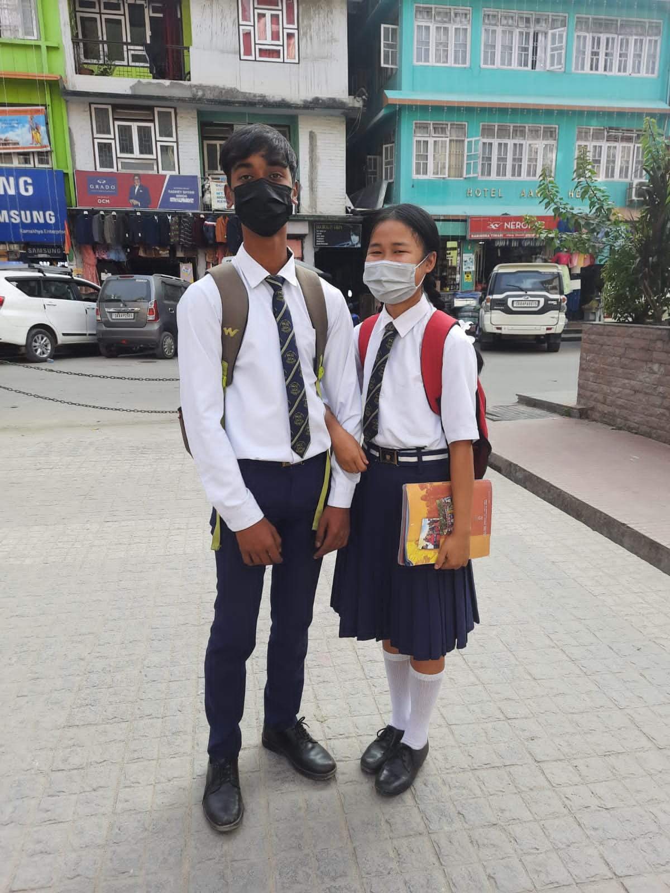
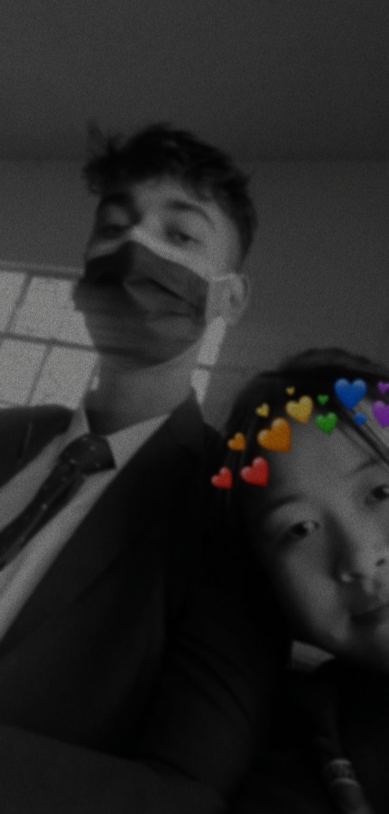
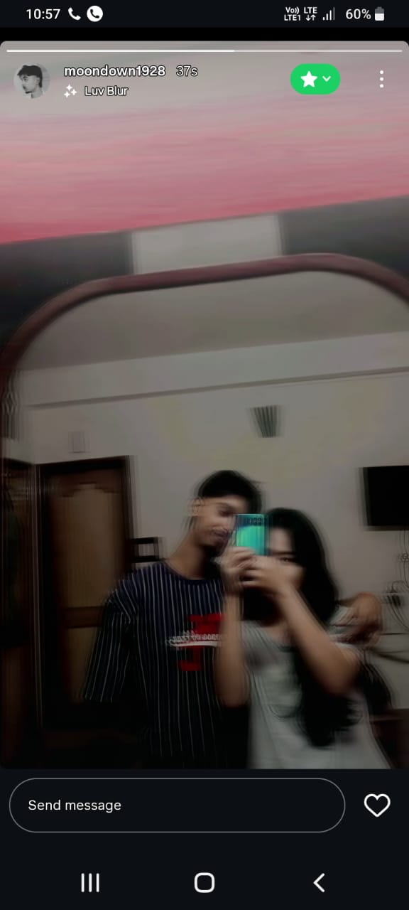
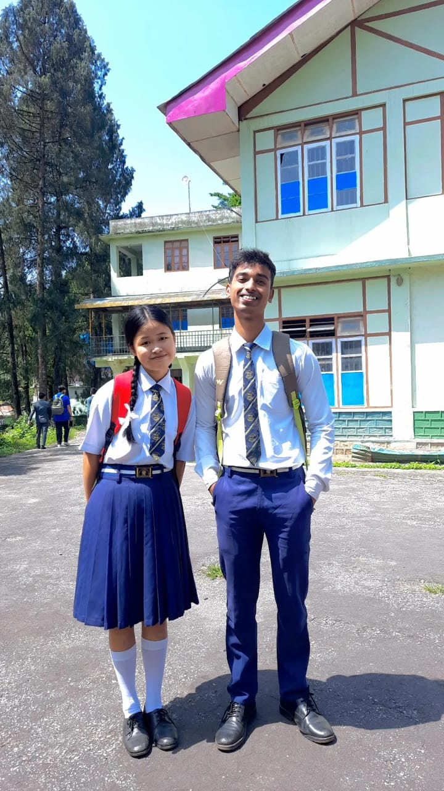
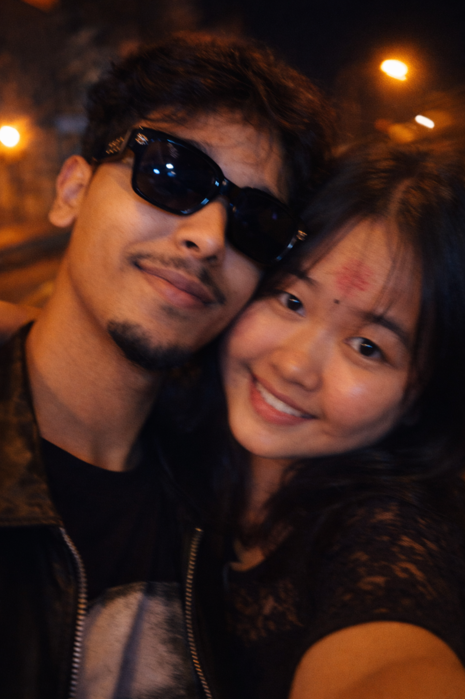

<!DOCTYPE html><html>
<head><meta name="viewport" content="width=device-width, initial-scale=1">
<title>Rohit ❤️ Punya</title></head><body>
<h1>Rohit ❤️ Punya</h1>
5 Years of Love
<button onclick="start()">Open Our Love Story</button>

<h2>Our Beautiful Memories</h2>

<h2>Our Story</h2>
💫 The day Rohit met Punya

💫 Our first picture together

💫 Falling in love

💫 5 amazing years together

💫 Forever to go ❤️

<h2>Punya, will you stay with Rohit forever?</h2><button onclick="alert('I love you Punya ❤️')">YES</button>

<button id="no">NO</button>

<iframe width="0" height="0"
src="https://www.youtube.com/embed/jnT6XUeY9r4?autoplay=1&loop=1"
allow="autoplay">
</iframe></body>
</html>
